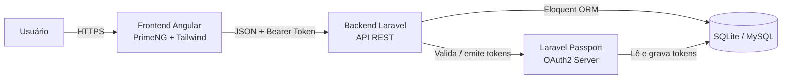
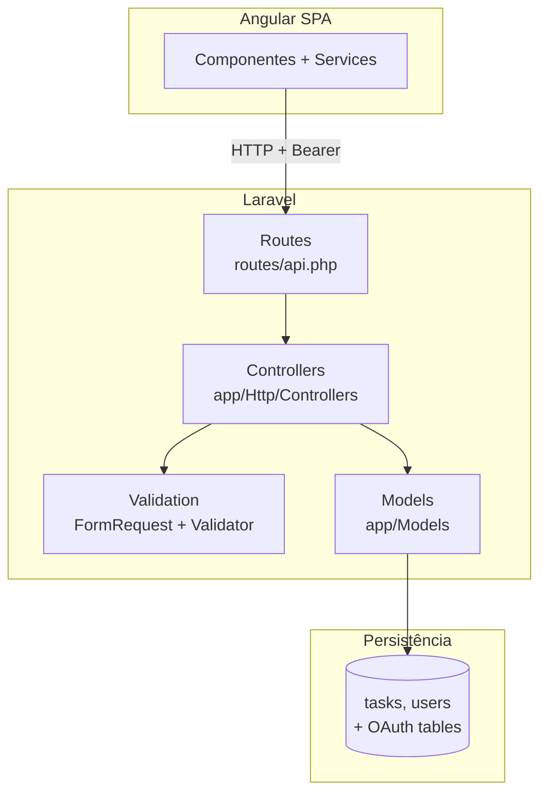

# Task Management CRUD API


API RESTful para gerenciamento de tarefas, com autenticação OAuth2 via Laravel Passport. Este pacote é o **backend** de um monorepo cujo frontend (Angular + PrimeNG) vive em `/frontend`. Toda a comunicação entre as duas pontas passa por JSON + `Authorization: Bearer {token}`.

---

## 📋 Sobre o projeto

A API expõe um CRUD de tarefas vinculadas ao usuário autenticado. Cada usuário enxerga apenas as próprias tarefas (escopo aplicado no controller a partir de `auth('api')->id()`) e as mutações exigem um token OAuth2 válido emitido por `POST /api/login`.

Funcionalidades cobertas:

- Autenticação por **Password Grant** (Passport) e proteção das rotas sensíveis com o middleware `auth:api`.
- CRUD completo de tarefas (criar, listar com paginação, mostrar, atualizar, excluir) com eager loading do relacionamento `user`.
- Filtros e ordenação em `GET /api/tasks` por `id`, `tarefa`, `status`, `prioridade`, `criado_em`, `atualizado_em` e `user.name`.
- Endpoints auxiliares de **usuários** (`GET/POST /api/users`, `DELETE /api/users/{id}`) e **estatísticas** (`GET /api/stats`).
- Locale `pt_BR`, mensagens de validação em português.

## 🛠️ Tecnologias

**Backend** (`backend/`)

| Camada | Tecnologia | Versão |
| --- | --- | --- |
| Linguagem | PHP | `^8.3` |
| Framework | Laravel | `^13.17` |
| Auth OAuth2 | Laravel Passport | `^13.0` |
| ORM | Eloquent (SQLite default, MySQL opcional) | — |
| Testes | Pest + Pest Laravel Plugin | `^5.2` |
| Lint/Formatação | Laravel Pint | `^1.27` |
| Localização | lucascudo/laravel-pt-br-localization | `^3.0` |

**Frontend** (`frontend/`) — documentado em [`../frontend/README.md`](../frontend/README.md)

| Camada | Tecnologia | Versão |
| --- | --- | --- |
| Framework | Angular (standalone) | `^21.2` |
| UI Kit | PrimeNG + PrimeUIX themes + PrimeIcons | `^21.1` |
| Ícones | FontAwesome (free solid) | `^7.1` |
| Estilo utilitário | Tailwind CSS v4 | `^4.1` |
| Testes | Vitest + jsdom | `^4.0` |

## 🏛️ Arquitetura

Monorepo com dois pacotes isolados: `backend/` (Laravel) e `frontend/` (Angular). O frontend consome a API via HTTP; o backend é stateless e delega sessão/estado ao Passport (tokens persistidos no banco).



Camadas do backend:



Repositório: <https://github.com/Guilh3rme-August0-bs/laravel-task-management-api>

## ✅ Pré-requisitos

- **PHP 8.3+** com extensões `pdo_sqlite` (default) ou `pdo_mysql` (caso troque o driver).
- **Composer 2.x**.
- **Node.js 20+** e **npm 10+** apenas se você for rodar o frontend em [`../frontend`](../frontend).
- Opcional: **Laravel Sail** ou **Docker** caso prefira isolar o ambiente (não há `docker-compose.yml` versionado até o momento — ver [limitações](#limitações-conhecidas)).

> Em Linux, o jeito mais rápido de obter PHP + Composer é o [`php.new`](https://php.new): `curl -fsSL https://php.new/install/linux/8.3 | bash`.

## 🚀 Instalação

```bash
# 1. Entrar no pacote de backend
cd backend

# 2. Instalar dependências PHP
composer install

# 3. Copiar e ajustar variáveis de ambiente
cp .env.example .env
php artisan key:generate

# 4. Criar o banco e instalar o Passport
php artisan migrate
php artisan passport:install     # cria clientes OAuth2 e chaves de assinatura

# 5. Subir o servidor de desenvolvimento
php artisan serve --port=8000
```

A API passa a responder em `http://localhost:8000`. O frontend (em outro terminal) sobe com `npm start` dentro de `frontend/` e consome `http://localhost:8000/api`.

## 💾 Banco de dados e seed

O projeto usa **SQLite** por padrão (`DB_CONNECTION=sqlite` em `.env.example`) — não é necessário subir um SGBD externo para o ambiente local. Se preferir MySQL, descomente e preencha o bloco `DB_*` no `.env` antes de rodar as migrations.

```bash
# Criar o arquivo do SQLite (somente na primeira vez, em SQLite)
touch database/database.sqlite

# Rodar todas as migrations (cria users, tasks, OAuth2 tables, etc.)
php artisan migrate

# (Opcional) Popular o banco com dados de exemplo
php artisan db:seed
```

O `DatabaseSeeder` cria um único usuário de teste:

| Campo | Valor |
| --- | --- |
| `name` | `Test User` |
| `email` | `test@example.com` |
| `password` | `password` |

> Não existe factory/seed de tarefas. Para popular manualmente, use `POST /api/tasks` autenticado ou `php artisan tinker`.

## 🔐 Variáveis de ambiente

Copie `.env.example` para `.env` e ajuste conforme necessário. Principais chaves:

| Variável | Obrigatório | Descrição |
| --- | --- | --- |
| `APP_NAME` | sim | Nome exibido em logs e-mails. |
| `APP_ENV` | sim | `local`, `production`, etc. |
| `APP_KEY` | sim | Gerado por `php artisan key:generate`. |
| `APP_DEBUG` | sim | `true` em dev, `false` em produção. |
| `APP_URL` | sim | URL base do backend (ex.: `http://localhost:8000`). |
| `APP_LOCALE` | recomendado | `pt_BR` para mensagens em português. |
| `DB_CONNECTION` | sim | `sqlite` (default) ou `mysql`. |
| `DB_HOST` / `DB_PORT` / `DB_DATABASE` / `DB_USERNAME` / `DB_PASSWORD` | se MySQL | Credenciais do SGBD. |
| `SESSION_DRIVER` | sim | Default do `.env.example`: `database`. |
| `CACHE_STORE` | sim | Default: `database`. |
| `QUEUE_CONNECTION` | sim | Default: `database` (pode ir para `sync` em dev). |
| `LOG_CHANNEL` / `LOG_LEVEL` | sim | Stack de logs; default `stack` / `debug`. |
| `MAIL_MAILER` | sim | `log` em dev — e-mails vão para `storage/logs`. |
| `PASSPORT_PRIVATE_KEY` / `PASSPORT_PUBLIC_KEY` | produção | Sobrescrevem as chaves geradas pelo `passport:install`. |
| `PASSPORT_PERSONAL_ACCESS_CLIENT_ID` / `PASSPORT_PERSONAL_ACCESS_CLIENT_SECRET` | produção | IDs/secrets do client *Personal Access*. |

> O `php artisan passport:install` cuida de gerar clientes, chaves e inserir os IDs necessários no `.env`. Reexecute o comando apenas se quiser rotacionar credenciais.

## 📡 Endpoints da API

Base URL local: `http://localhost:8000/api`. Todas as rotas (exceto `login`, `users`, `stats`, `service` e `request`) exigem `Authorization: Bearer {token}`.

### Autenticação

#### `POST /login`

Autentica o usuário via Password Grant e devolve o access token.

```bash
curl --location --request POST 'http://localhost:8000/api/login' \
  --header 'Content-Type: application/json' \
  --header 'Accept: application/json' \
  --data-raw '{
      "email": "test@example.com",
      "password": "password"
  }'
```

**200**
```json
{
  "user": { "id": 1, "name": "Test User", "email": "test@example.com" },
  "token": "eyJ0eXAiOiJKV1QiLCJhbGc..."
}
```

**401**
```json
{ "message": "Credenciais inválidas" }
```

#### `GET /` (rota interna, `auth:api`)

Retorna o usuário dono do token atual.

### Tarefas (`/tasks`)

Todas as rotas deste bloco estão sob `auth:api` e operam **apenas sobre as tarefas do usuário autenticado** (`where user_id = auth('api')->id()`). O relacionamento `user` é carregado via eager loading com `select('id','name')`.

#### `POST /tasks`

Cria uma tarefa e a vincula automaticamente ao usuário do token.

```bash
curl --location --request POST 'http://localhost:8000/api/tasks' \
  --header 'Content-Type: application/json' \
  --header 'Accept: application/json' \
  --header 'Authorization: Bearer {seu-token}' \
  --data-raw '{
      "tarefa": "Implementar autenticação",
      "descricao": "Adicionar OAuth2 com Laravel Passport",
      "status": "PENDENTE",
      "prioridade": "ALTA"
  }'
```

**Regras de validação (store)**

- `tarefa`: obrigatório, string, máx. 50 caracteres, **único** na tabela.
- `descricao`: opcional, string, máx. 255 caracteres.
- `status`: obrigatório, `PENDENTE | EM_ANDAMENTO | CONCLUIDA`.
- `prioridade`: obrigatório, `BAIXA | MEDIA | ALTA`.

**200**
```json
{
  "nova_tarefa": {
    "id": 1,
    "tarefa": "Implementar autenticação",
    "descricao": "Adicionar OAuth2 com Laravel Passport",
    "status": "PENDENTE",
    "prioridade": "ALTA",
    "user_id": 1,
    "created_at": "2026-10-02T10:52:00.000000Z",
    "updated_at": "2026-10-02T10:52:00.000000Z"
  }
}
```

#### `GET /tasks`

Lista paginada das tarefas do usuário, com filtros e ordenação.

**Parâmetros de query**

| Param | Tipo | Valores aceitos | Default |
| --- | --- | --- | --- |
| `per_page` | int | `10`, `20`, `25`, `50`, `100` | `10` |
| `sort_by` | string | `id`, `tarefa`, `descricao`, `status`, `prioridade`, `created_at`, `updated_at`, `user.name` | — |
| `sort_order` | string | `asc`, `desc` | — |
| `filter_id` | int | — | — |
| `filter_tarefa` | string | contém (LIKE) | — |
| `filter_status` | string | `PENDENTE | EM_ANDAMENTO | CONCLUIDA` | — |
| `filter_prioridade` | string | `BAIXA | MEDIA | ALTA` | — |
| `filter_usuario` | string | contém no `users.name` | — |
| `filter_criado_em` | date | `YYYY-MM-DD` | — |
| `filter_atualizado_em` | date | `YYYY-MM-DD` | — |

```bash
curl --location --request GET 'http://localhost:8000/api/tasks?per_page=20&filter_status=PENDENTE&sort_by=user.name&sort_order=asc' \
  --header 'Accept: application/json' \
  --header 'Authorization: Bearer {seu-token}'
```

**200**
```json
{
  "tarefas:": {
    "current_page": 1,
    "data": [
      {
        "id": 1,
        "tarefa": "Implementar autenticação",
        "descricao": "Adicionar OAuth2 com Laravel Passport",
        "status": "PENDENTE",
        "prioridade": "ALTA",
        "user_id": 1,
        "created_at": "2026-10-02T10:52:00.000000Z",
        "updated_at": "2026-10-02T10:52:00.000000Z",
        "user": { "id": 1, "name": "Test User" }
      }
    ],
    "first_page_url": "http://localhost:8000/api/tasks?page=1",
    "from": 1,
    "last_page": 1,
    "last_page_url": "http://localhost:8000/api/tasks?page=1",
    "links": [],
    "next_page_url": null,
    "path": "http://localhost:8000/api/tasks",
    "per_page": 10,
    "prev_page_url": null,
    "to": 1,
    "total": 1
  }
}
```

#### `GET /tasks/{id}`

Detalhe de uma tarefa do usuário autenticado. `404` quando não encontrada.

```bash
curl --location --request GET 'http://localhost:8000/api/tasks/1' \
  --header 'Accept: application/json' \
  --header 'Authorization: Bearer {seu-token}'
```

**200**
```json
{
  "tarefa selecionada:": {
    "id": 1,
    "tarefa": "Implementar autenticação",
    "descricao": "Adicionar OAuth2 com Laravel Passport",
    "status": "PENDENTE",
    "prioridade": "ALTA",
    "user_id": 1,
    "created_at": "2026-10-02T10:52:00.000000Z",
    "updated_at": "2026-10-02T10:52:00.000000Z",
    "user": { "id": 1, "name": "Test User" }
  }
}
```

**404**
```json
{ "message": "No query results for model [App\\Models\\Task] {id}" }
```

#### `PUT /tasks/{id}`

Atualiza uma tarefa do usuário. Usa `App\Http\Requests\UpdateTaskRequest` (valida `tarefa` como única exceto a própria tarefa).

```bash
curl --location --request PUT 'http://localhost:8000/api/tasks/1' \
  --header 'Content-Type: application/json' \
  --header 'Accept: application/json' \
  --header 'Authorization: Bearer {seu-token}' \
  --data-raw '{
      "tarefa": "Implementar autenticação",
      "descricao": "OAuth2 implementado com sucesso",
      "status": "CONCLUIDA",
      "prioridade": "ALTA"
  }'
```

**200**
```json
{
  "tarefa atualizada": {
    "id": 1,
    "tarefa": "Implementar autenticação",
    "descricao": "OAuth2 implementado com sucesso",
    "status": "CONCLUIDA",
    "prioridade": "ALTA",
    "user_id": 1,
    "created_at": "2026-10-02T10:52:00.000000Z",
    "updated_at": "2026-10-02T11:00:00.000000Z",
    "user": { "id": 1, "name": "Test User" }
  }
}
```

#### `DELETE /tasks/{id}`

Hard delete. Retorna a tarefa removida. `404` quando não encontrada.

```bash
curl --location --request DELETE 'http://localhost:8000/api/tasks/1' \
  --header 'Accept: application/json' \
  --header 'Authorization: Bearer {seu-token}'
```

**200**
```json
{
  "tarefa excluída": {
    "id": 1,
    "tarefa": "Implementar autenticação",
    "descricao": "OAuth2 implementado com sucesso",
    "status": "CONCLUIDA",
    "prioridade": "ALTA",
    "user_id": 1,
    "created_at": "2026-10-02T10:52:00.000000Z",
    "updated_at": "2026-10-02T11:00:00.000000Z",
    "user": { "id": 1, "name": "Test User" }
  }
}
```

### Usuários (`/users`)

Rotas abertas (sem `auth:api`) — usadas pelo frontend na tela de cadastro e para popular combos. **Devem ser protegidas ou removidas antes de ir para produção.**

#### `GET /users`

Lista todos os usuários.

```bash
curl --location --request GET 'http://localhost:8000/api/users' \
  --header 'Accept: application/json'
```

**200**
```json
{ "usuários": [ { "id": 1, "name": "Test User", "email": "test@example.com" } ] }
```

#### `POST /users`

Cria um usuário. Validação: `name` (obrigatório, máx. 255), `email` (obrigatório, único), `password` (obrigatório, mín. 8).

```bash
curl --location --request POST 'http://localhost:8000/api/users' \
  --header 'Content-Type: application/json' \
  --header 'Accept: application/json' \
  --data-raw '{
      "name": "Fulano",
      "email": "fulano@example.com",
      "password": "segredo123"
  }'
```

**200**
```json
{ "usuário criado": { "id": 2, "name": "Fulano", "email": "fulano@example.com" } }
```

#### `DELETE /users/{id}`

Remove um usuário. `404` quando não encontrado.

```bash
curl --location --request DELETE 'http://localhost:8000/api/users/2' \
  --header 'Accept: application/json'
```

**200**
```json
{ "usuário deletado": "Fulano" }
```

### Estatísticas (`/stats`)

Rota aberta. Devolve indicadores agregados de tarefas (geral + por usuário).

```bash
curl --location --request GET 'http://localhost:8000/api/stats' \
  --header 'Accept: application/json'
```

**200**
```json
{
  "geral": {
    "total_tarefas": 12,
    "tarefas_pendentes": 5,
    "tarefas_em_andamento": 4,
    "tarefas_concluidas": 3
  },
  "por_usuario": [
    { "usuario_id": 1, "usuario_nome": "Test User", "total_tarefas": 12, "pendentes": 5, "em_andamento": 4, "concluidas": 3 }
  ]
}
```

### Rotas auxiliares (estudo / playground)

- `GET /service` — endpoint do `DIController` que exercita **injeção de dependência** com `App\services\TaskService`. Útil para validar o container.
- `POST /request` — endpoint do `RequestController` que devolve metadados do request (`path`, `url`, `host`, `schemeAndHttpHost`, etc.) e valida um payload mínimo. Útil para debugging.

> Documentação OpenAPI/Swagger ainda não está publicada — ver [melhorias futuras](#melhorias-futuras).

## 🌿 Fluxo Git

O repositório adota **Conventional Commits** para mensagens e **feature branches + Pull Request** para integrar à `main`.

| Tipo de commit | Quando usar |
| --- | --- |
| `feat` | Nova funcionalidade (ex.: `feat: filtros funcionais`). |
| `fix` | Correção de bug (ex.: `fix: largura da célula de registros vazios`). |
| `style` | Mudança visual que não altera comportamento (ex.: `style: reestilização de inputs`). |
| `refactor` | Reorganização interna sem mudar contrato. |
| `chore` | Tarefas de manutenção (deps, configs, CI). |

**Fluxo padrão:**

1. Crie uma branch a partir de `main`: `git checkout -b feat/minha-feature`.
2. Faça commits pequenos e descritivos seguindo o padrão acima.
3. Abra um Pull Request contra `main` descrevendo o que mudou e como testar.
4. Após code review e CI verde, faça o merge (squash ou merge commit, a critério do reviewer).

**Referência:** o PR **#1** (`feat: migração de UI para PrimeNG`) foi merged em `main` a partir da branch `primeng` — é o exemplo canônico do fluxo adotado.

```text
0bc8a3f Merge pull request #1 from Guilh3rme-August0-bs/primeng
```

## 💡 Decisões técnicas, limitações e melhorias

### Decisões técnicas

- **OAuth2 Password Grant via Passport** — apropriado para um cliente SPA próprio. Para integrações com terceiros, expanda para *Authorization Code* + PKCE.
- **SQLite como default de desenvolvimento** — zero infra para rodar localmente; MySQL continua disponível descomentando o bloco `DB_*` no `.env`.
- **Hard delete em tarefas** — simples e suficiente para o escopo atual; troca para soft delete é uma migration simples.
- **Eager loading com `select('id','name')`** no relacionamento `user` — evita N+1 e reduz o payload.
- **Escopo por usuário no controller** — `Task::where('user_id', auth('api')->id())` em todas as operações sensíveis.
- **Validação híbrida** — `store` usa `Validator::make` inline (retorna `erro`); `update` usa `FormRequest` dedicado (`App\Http\Requests\UpdateTaskRequest`) com mensagens em pt_BR.
- **Locale `pt_BR`** para mensagens de validação e faker.
- **Frontend standalone (Angular 21) + PrimeNG + Tailwind v4** — componentes prontos (table, paginator, modal, toast) aceleram a entrega sem abrir mão de customização visual.

### Limitações conhecidas

- **Sem OpenAPI/Swagger** — a documentação de endpoints é manual e vive apenas neste README.
- **Sem `docker-compose.yml` versionado** — a stack roda direto na máquina; a conteinerização é uma evolução pendente.
- **Endpoints `/users`, `/stats`, `/service` e `/request` são públicos** — não estão sob `auth:api` e devem ser protegidos (ou removidos) antes de expor a API.
- **Sem refresh token rotation** configurado — apenas access tokens Password Grant.
- **Sem soft delete** — `DELETE /tasks/{id}` é hard delete.
- **`tarefa` é globalmente única** (não escopada por usuário) — pode gerar conflito de nomes entre contas distintas.
- **Sem factory/seed de tarefas** — apenas o `UserFactory` é populado pelo `DatabaseSeeder`.
- **Cobertura de testes** — não há testes automatizados para os endpoints de tasks/users/stats.
- **Sem `FormRequest` no `store`** de tarefas — a validação é inline; vale uniformizar.
- **Sem API Resources** — as respostas devolvem o model cru dentro de chaves descritivas (`nova_tarefa`, `tarefas:`, etc.).

### Melhorias futuras

1. **OpenAPI/Swagger** — publicar a especificação (ex.: `darkaonline/l5-swagger`) e servir `GET /api/documentation`.
2. **Docker Compose** — serviços `app` (PHP-FPM + nginx) e `db` (MySQL) prontos para `docker compose up`.
3. **Refresh tokens + revogação** — habilitar `passport:client --personal` com lifetimes explícitos e rotação.
4. **Autorização por Policy** — `TaskPolicy@view/update/delete` amarrada ao `user_id`.
5. **Soft delete + audit log** — `SoftDeletes` em `Task` + tabela `task_audits`.
6. **Factory e seed de tarefas** — popular dados de exemplo por usuário.
7. **Cobertura Pest** — testes de feature para `auth`, `tasks` (incluindo ownership) e `users`.
8. **Rate limiting** — `throttle:api` + `throttle:login` para mitigar brute force.
9. **API Resources** — padronizar envelopes de resposta (`data`, `meta`, `errors`).
10. **CI no GitHub Actions** — pipeline com `composer install`, `pint --test`, `php artisan test`.

## 🔗 Links úteis

- **Repositório:** <https://github.com/Guilh3rme-August0-bs/laravel-task-management-api>
- **PR #1 (referência de fluxo):** [Merge pull request #1 from Guilh3rme-August0-bs/primeng](https://github.com/Guilh3rme-August0-bs/laravel-task-management-api/pull/1)
- **Laravel:** <https://laravel.com/docs>
- **Laravel Passport:** <https://laravel.com/docs/passport>
- **Pest:** <https://pestphp.com>
- **Documentação OpenAPI (referência para evolução):** <https://swagger.io/specification/>

> **Status de deploy:** esta API ainda não está publicada em ambiente público. Os links acima apontam para o repositório e o PR de referência; URLs de staging/produção serão adicionadas aqui assim que o deploy for provisionado.
